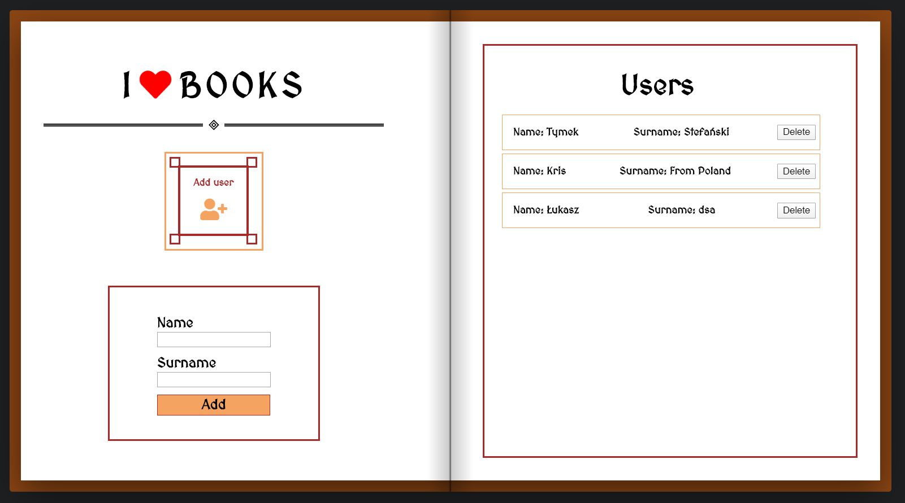
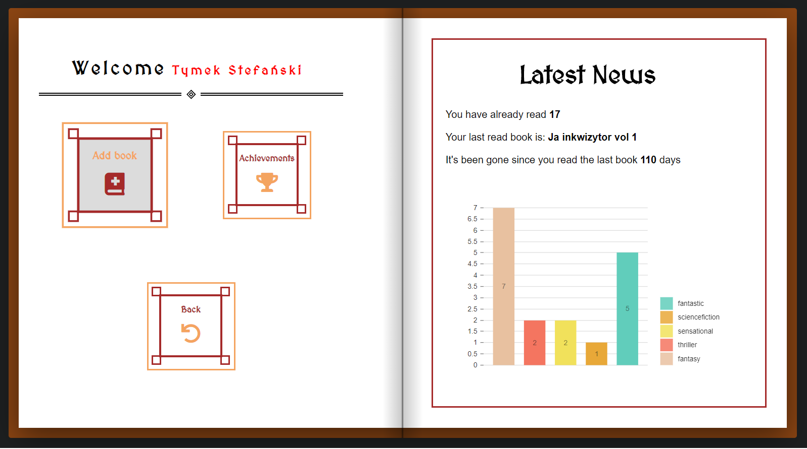
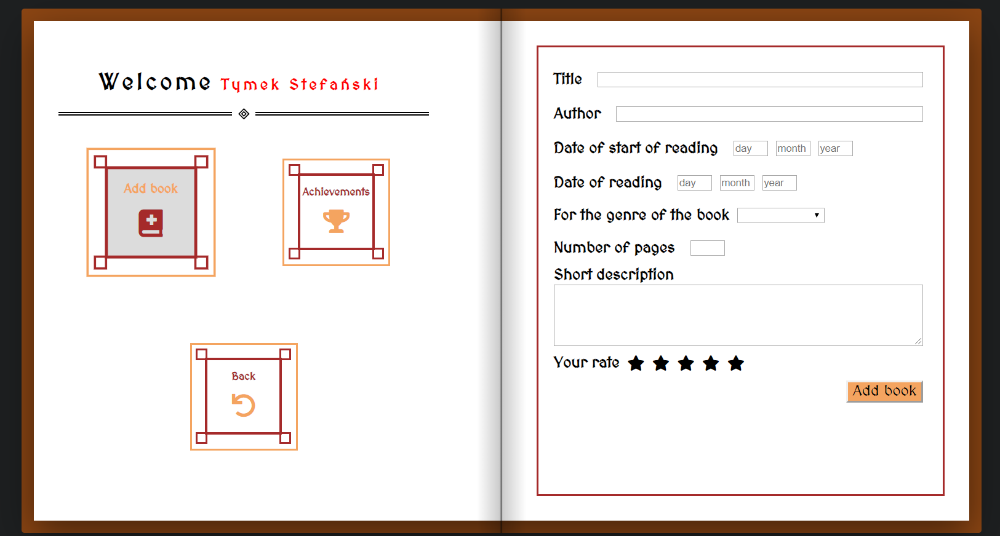
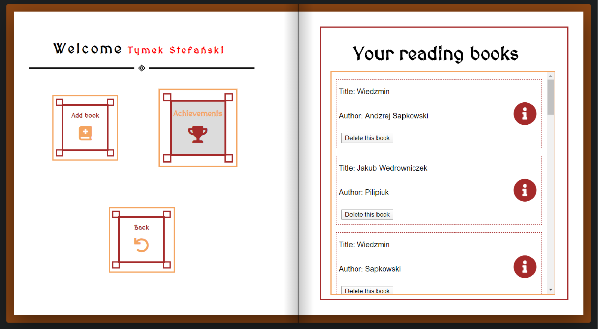

# ILoveBooks
---
## Table of contents
* [General info](#general-info)
* [Technologies](#technologies)
* [Setup](#setup)
* [Sample pictures](#sample-pictures)

## General info
An application used to add read books by a user created by him. The application allows you to see statistics of books read, the time that has elapsed since reading the last book, etc. The application saves and downloads data from json-server using the Fetch API
	
## Technologies
Project is created with:
* React Router
* Fetch
* React
* Sass
* json-server
* webpack
	
## Setup
To run this project, install it locally using npm:
```
$ cd ../lorem
$ npm install
$ npm start
```
To run json.server:
```
$ cd ../lorem
$ json-server book.json.server
```

## Sample pictures






